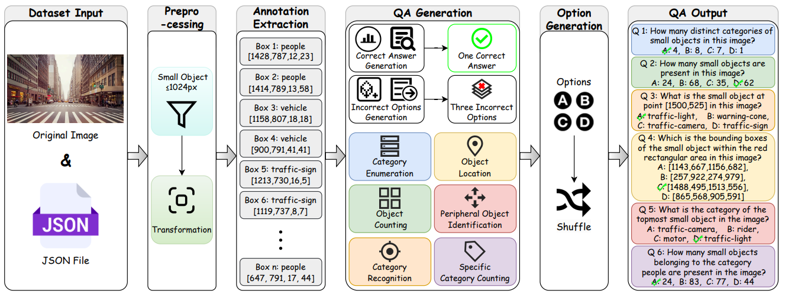
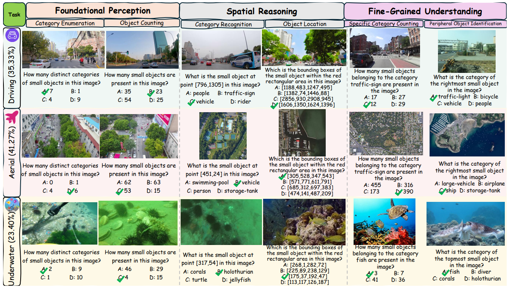
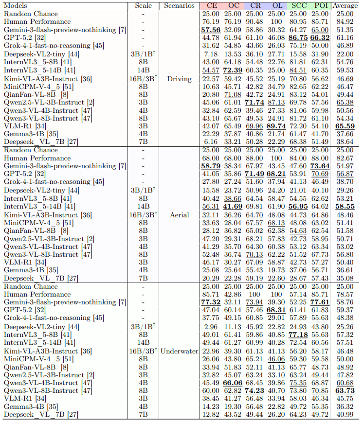

# Can Multimodal Large Language Models Truly Understand Small Objects?

[**[📖 Paper]**](链接) | [**[📊 Dataset (Hugging Face)]**](你的HF链接)

## 🌟 Highlights
* **First-Ever Benchmark**: To the best of our knowledge, MLLMs based Small Object Understanding (SOU) tasks are proposed for the first time. A comprehensive benchmark (**SOUBench**), including relative datasets and baselines, is reported for the specific task. SOUBench fully reveals the shortcomings of current MLLMs in understanding small objects.
* **Comprehensive Evaluation**: We design an effective automatic visual question-answer generation pipeline and introduce a comprehensive SOU-VQA evaluation dataset for small object understanding tasks, with **18,204** pairs and six relevant sub-tasks. Comprehensive experiments and comparisons are conducted in 15 state-of-the-art MLLMs to evaluate the small object understanding capability of MLLMs. Sufficient results reveal that current MLLMs have a weak understanding ability in the proposed tasks, even the best MLLM is still behind Human performance by 23.53%.
* **Effcitive Fine-tuning**: We further construct **SOU-Train**, a multimodal VQA training dataset with **11,226** fine-grained annotations, to supervise the fine-tuning of the latest MLLM. The result denotes that the SOU-Train can effectively improve the small understanding ability of MLLM in different scenarios. Our research provides a crucial empirical foundation for the enhancement of the small object understanding capabilities of MLLMs.

# Step 1: VQA Construction (Take Driving Scenarios as an Example)

# Usage
Generate driving scene VQA datasets from COCO annotations.

**Files**:
- `json_manager.py`: JSON data management
- `CreateJson_Driving.py`: Dataset generator (6 task types)
- `val.json`: Example COCO annotations

**Prerequisites**:
1. Place your image dataset in the folder specified in `CreateJson_Driving.py` (e.g., `Images_Driving`)
2. Install dependencies: `pip install pycocotools opencv-python`

**Usage**:
1. Update image path in `CreateJson_Driving.py` to match your dataset folder
2. Run: `python CreateJson_Driving.py`

> [!NOTE]
> # Step 2: MLLMs evaluation (15 MLLMs)
# Updating...

# Step 3: Training
# Updating...
